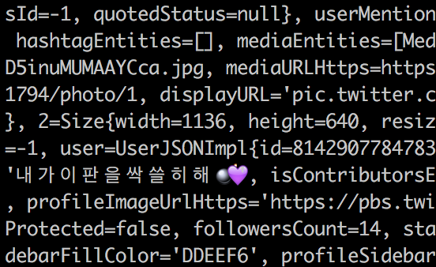
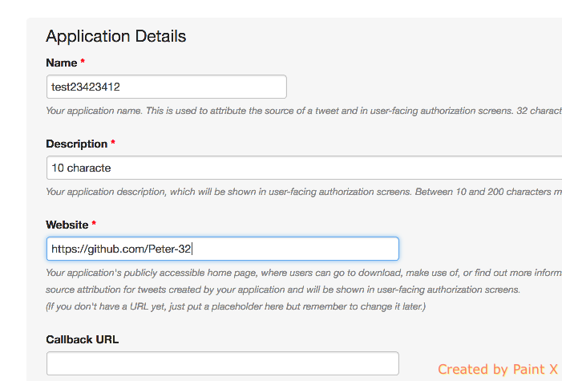
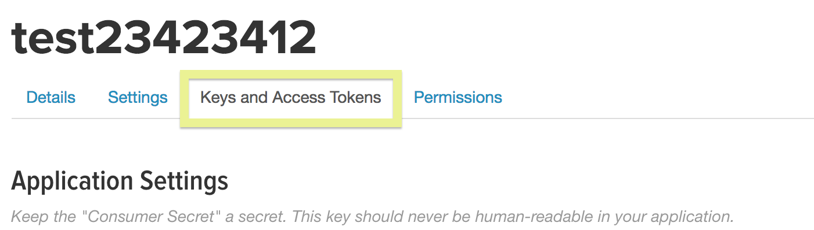
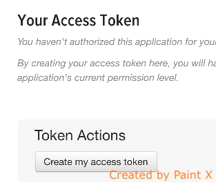

# SparkTwitter

## Summary
This project shows you how to get started with Spark Scala projects in an IDE.  It starts with a "Hello World!" application, then a simple MapReduce application, and lastly a Spark streaming application using the Twitter API.

## Example

## Features 

1. **HelloWorld Application**: This can be used to confirm that Spark is working.
  The code is from the official Spark site's [quick start tutorial](https://spark.apache.org/docs/latest/quick-start.html).
2. **FirstMapReduce Application**: This gets one familiar with the MapReduce functionality available when using Spark Scala.  It takes in a dictionary of words and outputs a file sorting the words by length.
3. **FirstStream Application**: This sets up a twitter spark streaming instance.  It collects tweets from Twitter in real time and outputs them to the console and files.

## Installation

1. Create a Twitter App (Easy)
2. Download Everything Needed
3. Adding Your Personal Configurations
4. Run a Console Command to Build
5. Run the Programs with Spark-Submit

### 1) Create a Twitter App (Easy)

First, to get it out of the way, create a [Twitter app](https://apps.twitter.com/) here.  The application is created after you fill out a form.  You can put any placeholder when they ask for your website.

#### Once Created, Edit the App and Visit the Keys and Access Tokens Page.

#### Copy Your Consumer Key and Consumer Secret to a Text File.  Then Click on The "Create My Access Token" Button.

#### Copy the Access Token and Access Token Secret to a Text File.

### 2) Download Everything Needed

#### This code

- Clone or download this project and open it in an IDE like Intellij.

#### Spark

- Visit [Apache Spark](https://spark.apache.org/downloads.html) and select "Spark release": "2.0.1", "package type": "Pre-built for Apache Hadoop 2.7 and later".  Then click on "Download Spark": "spark-2.0.1-bin-hadoop2.7.tgz.
- Unzip the file and move it to your favorite software directory.

#### Jars

- The Jars needed are already included in the directory src/lib

#### Scala Plugin

- Make sure your IDE has the Scala plugin.  If you're unsure, try searching online how to add the plugin for your IDE.

### 3) Adding Your Personal Configurations

#### a) Add a twitter4j.properties File

Create a "twitter4j.properties" file in directory src/main/resources which should include these four lines.  Replace "yourInputHere" with your access information.

	oauth.consumerKey=yourInputHere
	oauth.consumerSecret=yourInputHere
	oauth.accessToken=yourInputHere
	oauth.accessTokenSecret=yourInputHere

#### b) Update Spark Submit Commands File

- Open the file `"SparkTwitter/spark_submit_commands.txt"`.  Replace the code `/Users/peterjmyers/Documents/Other/No_Backup_Needed/spark-2.0.1-bin-hadoop2.7/bin/spark-submit` with your absolute file path to spark-submit.  There are three commands to update.
- If you get an error later on with these commands, try again while removing the quotations around local[4].  The quotations are required for the zsh termainal.

#### 4) Run a Console Command to Build

Run `sbt package` in the SparkTwitter directory.  After making changes to your Spark Scala projects, just run `sbt package` to prepare it for the spark-submit.

#### 5) Run the Programs with Spark-Submit

All commands are found in the `spark-submit_commands.txt` file.  The commands run the three applications.

## FAQ

### What If I Want a Different Spark or Scala Version?

1. The Scala and Spark versions need to be compatible with each other.
2. The Scala or Spark versions need to be compatible with the two jars `src/lib/twitter4j-core` and `src/lib/twitter4j-stream`.  This project works with these jars using Scala 2.11 and Spark 2.0.1.
3. Download a new `spark-streaming-twitter` jar.  The one included is `src/lib/spark-streaming-twitter_2.11-2.0.1.jar`.  The `2.11` stands for the Scala version and `2.0.1` is the Spark version.
4. After changing out any jars from point 2 or 3 above, you need to update the  `spark_submit_commands.txt` file.  You will need to update the jars for the spark streaming command.  If you change the Scala version, be sure to update the `2.11` Scala version number found in all commands.

### What Do the Parts of the SBT Mean?

* **version:** The version is your build version.  If this changes from `0.0.1` you need to update the `spark-streaming-twitter.txt` file to reference the new version instead of `0.0.1`.
* **scalaVersion:** The version of Scala.  This project uses Scala version `2.11.6`.
* **`2.0.1`:** This number shows up in the library dependencies.  It references the Spark version used.

### Why Are There Jars in src/lib Instead of Using the SBT (Simple Build Tool)

I believe the Spark Submit needs to have them included in the command.  I put them in the src/lib folder so they are easy to reference by the command.

### What Is the Expected Output of Each Application?

1. The HelloWorld application prints to the console.  You may have to search for it because of the verboseness of Spark.
2. The MapReduceExample application outputs a file to the `SparkTwitter/data_output` directory.  The dictionary is outputed by descending order of word length.
3. The FirstStream application outputs text to the console and tweets to the `SparkTwitter/data_output` directory.
