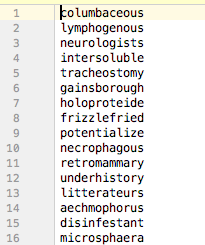

# SparkTwitter

## Summary
This project shows you how to get started with Spark.  It starts with a "Hello World" application, then a simple MapReduce application, and lastly a Spark streaming application using the Twitter API.

## Examples

example, features, installation, support, FAQ
